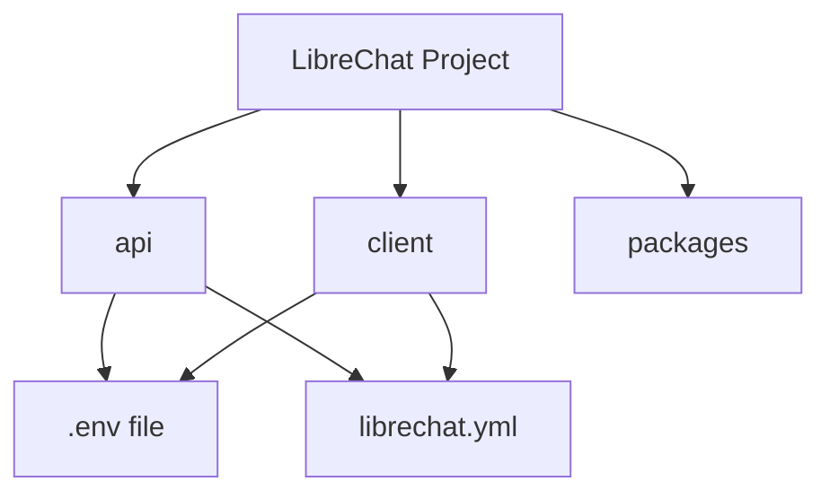
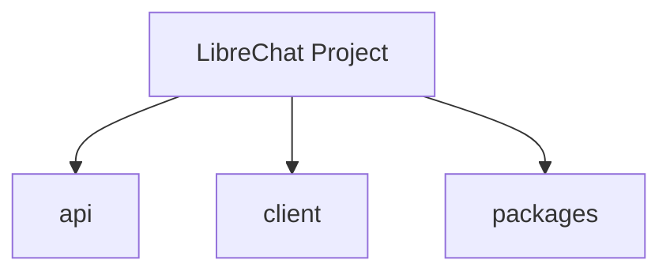
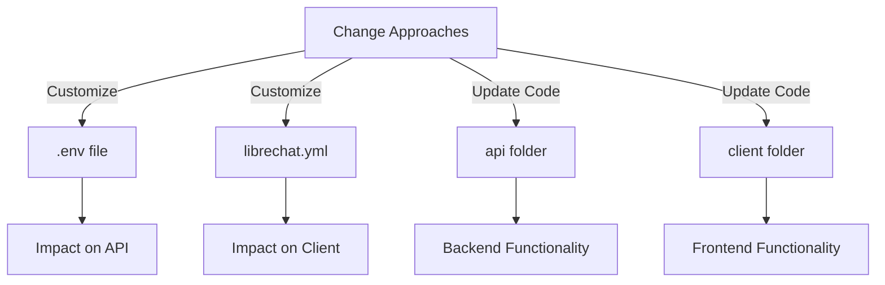
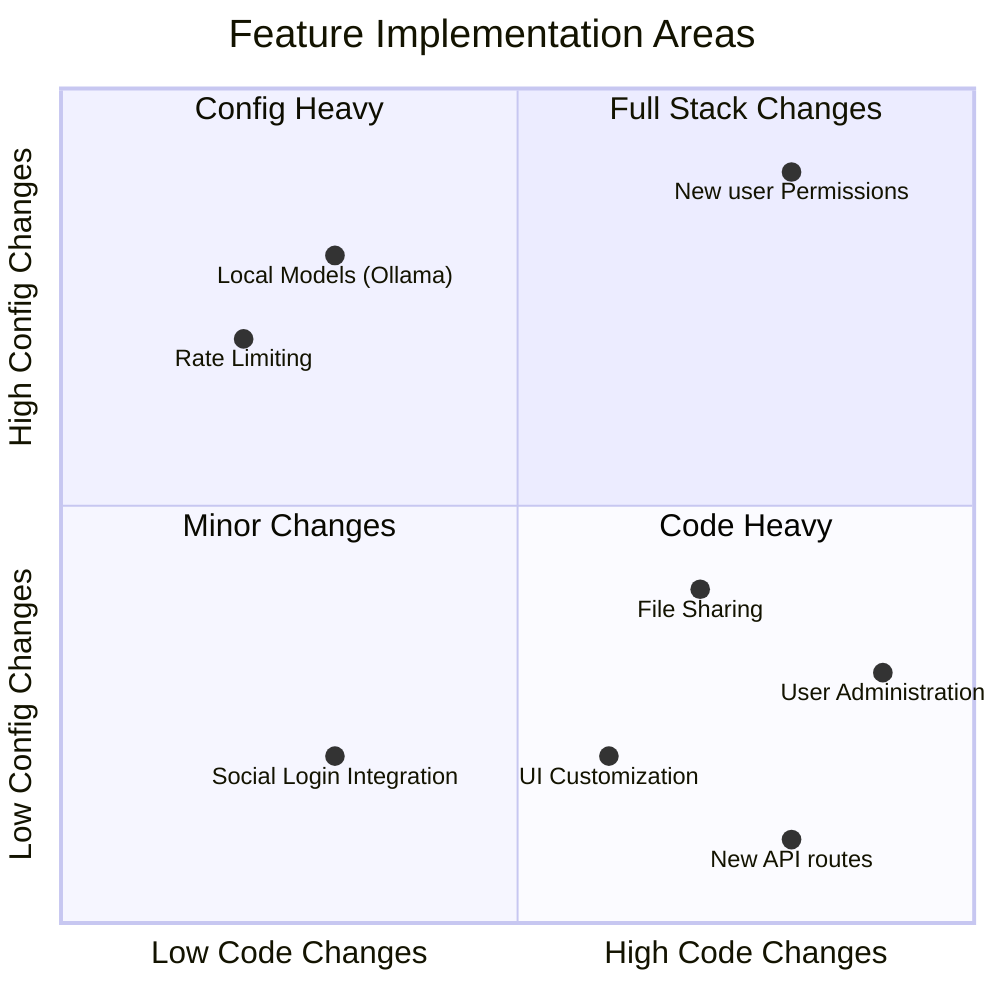
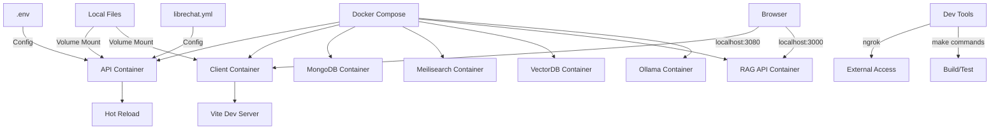
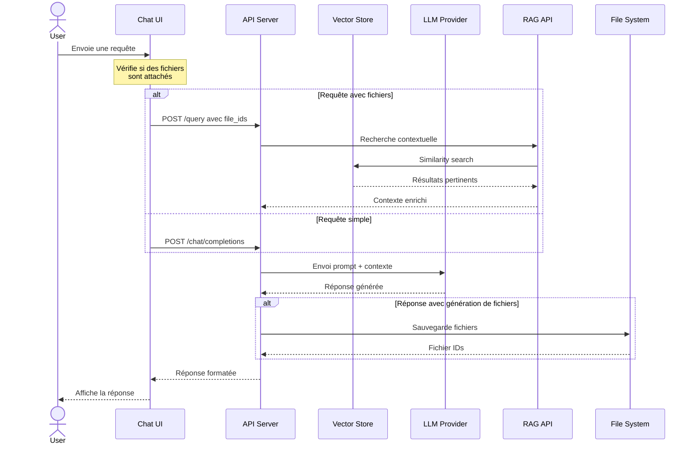

# Project Structure Overview

## Main Components

Description: Vue d'ensemble du projet montrant les dépendances des fichiers de configuration.

## Core Architecture

Description: Structure de base du projet montrant les composants principaux.

## Configuration change flow

Description: Processus de modification des fichiers de configuration.

## Feature Implementation Quadrant

Description: Répartition des modifications nécessaires par fonctionnalité.

## Local Development Architecture

Description: Architecture de développement local avec Docker.

Cette architecture montre :

1. Les conteneurs Docker nécessaires
2. Les montages de volumes
3. Les configurations
4. Les points d'accès développeur
5. Les outils de développement

Le diagramme quadrant montre que :

1. Les fonctionnalités comme l'intégration des réseaux sociaux nécessitent principalement des modifications de configuration
2. L'administration des utilisateurs et le partage de fichiers nécessitent des modifications importantes du code
3. La personnalisation de l'interface utilisateur est principalement axée sur le code frontend
4. L'intégration d'Ollama et la limitation du débit nécessitent principalement des modifications de configuration

## Query Flow Sequence

Description: Flux d'une requête utilisateur depuis l'interface de chat jusqu'à la réponse.

Ce diagramme montre :
Le flux principal d'une requête utilisateur
La gestion différenciée des requêtes avec/sans fichiers
L'interaction avec le système RAG
Le processus de génération de réponse
La gestion des fichiers générés
